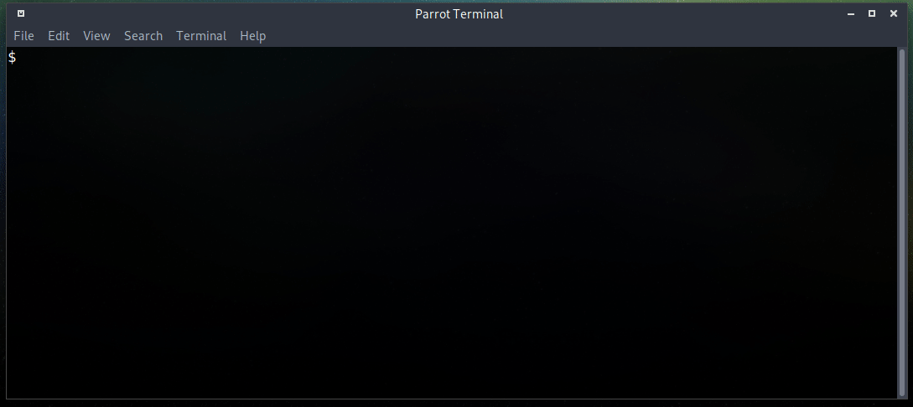

# F8648P Supertool

A tool to automatize obtaining a root shell and config decryption.

Installation:

- I recommend to use Linux for this. It can run on Windows too but you may have some troubles when installing some requirements.
- Prepare an USB drive NTFS formatted with the following files in the root folder. These files are in the repo in the /bin folder:
    - busybox
    - nc 
    - sh (just copy busybox to this name or symlink it)
    - raiz (symlink that can be made with the command ln -s / raiz)
- Clone or download this repo/folder
- Install dependencies
    - python3 -m pip install -r requirements.txt

Execution:

- python3 zte-supertool.py

